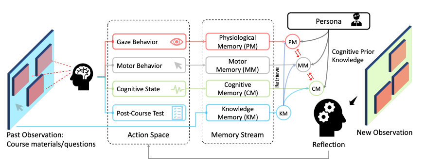
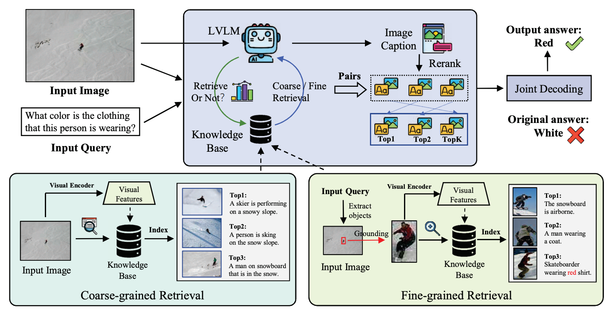

# paper_reading

#### LLM in Education Simulation

##### [EduAgent](https://arxiv.org/pdf/2404.07963)

对学生的学习进行了比较精细的模拟，有310个真实学生，705个合成的（虚拟）学生。

模拟场景为学生学习若干页的ppt，模拟内容包括学生画像、眼神聚焦、鼠标轨迹、ppt内容和测试等。

但感觉数据集有问题（例如一个ML专业的本科生做题做不过一个高中生）

### MLLM

#### Hallucination

##### [APA](https://arxiv.org/pdf/2408.00555v1)

* 是否需要retrieval需要判断
* 选择哪一种retrieval method需要判断
* 粗粒度检索和细粒度检索结合，细粒度要包括grounding